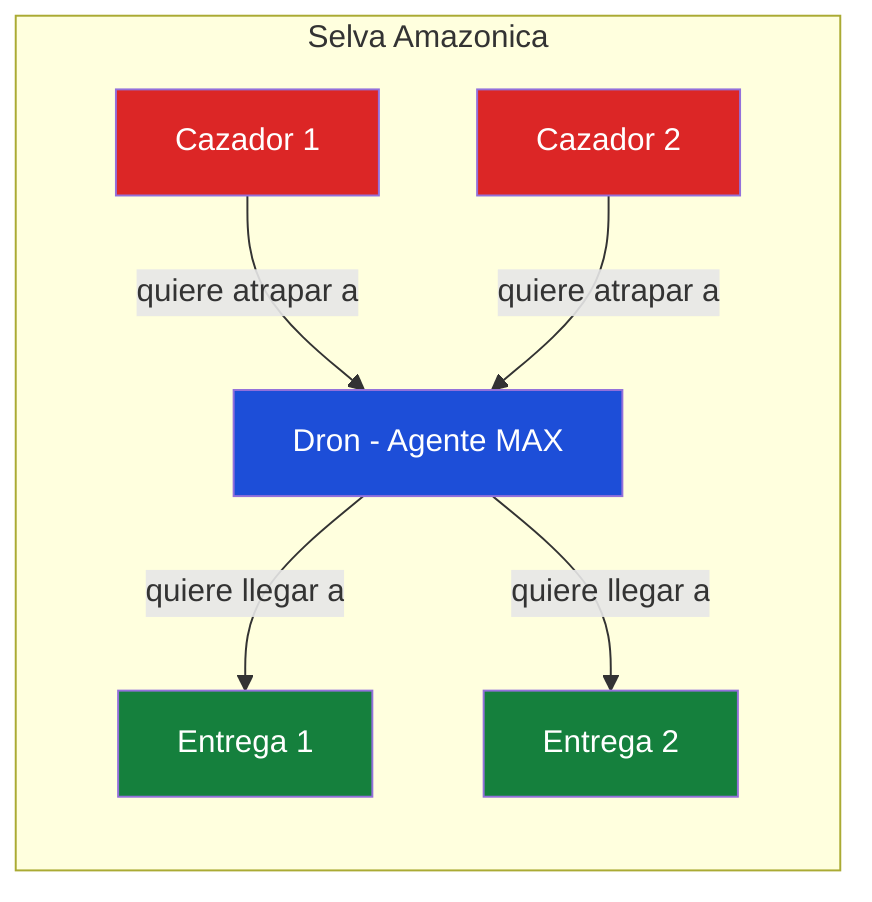
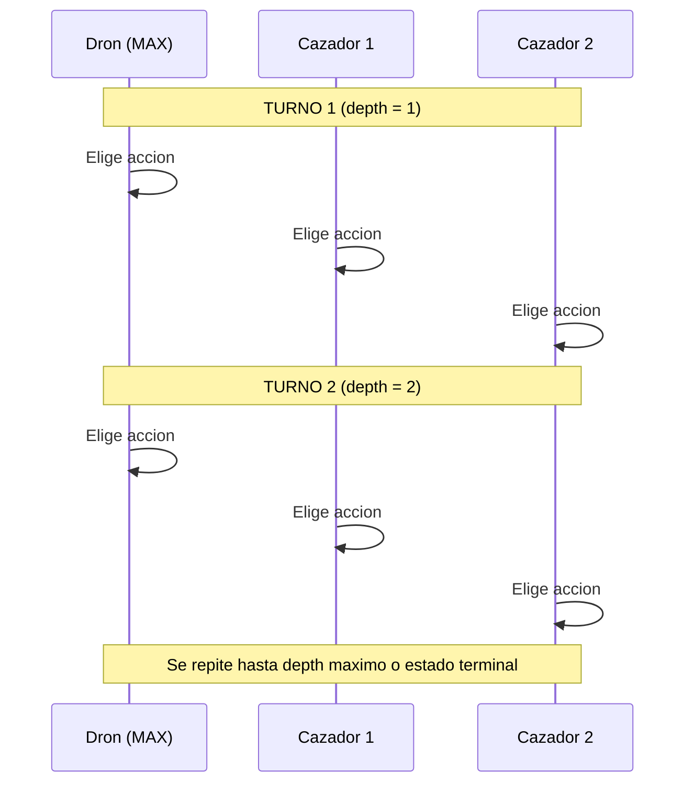
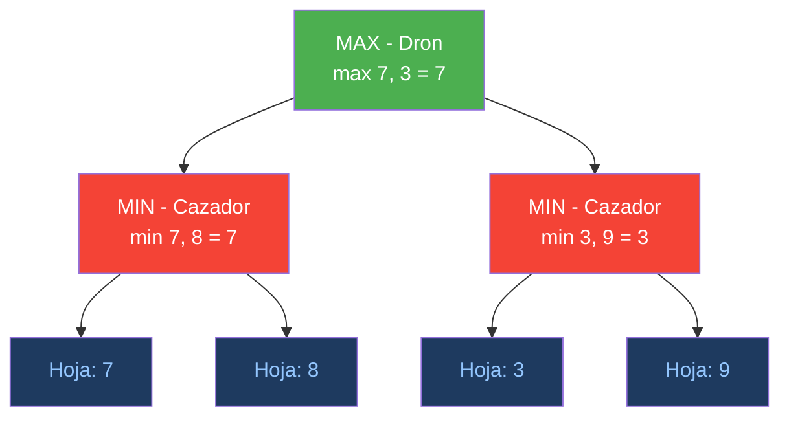
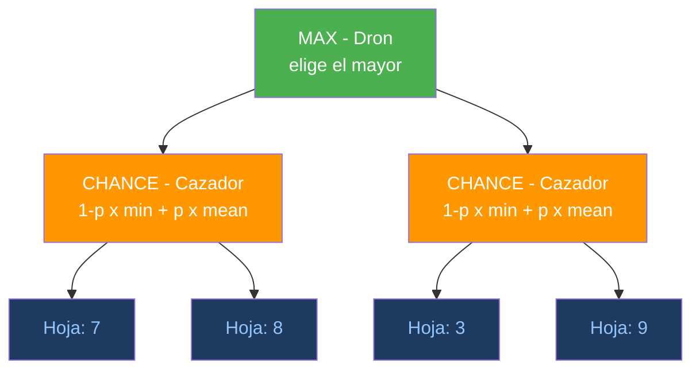
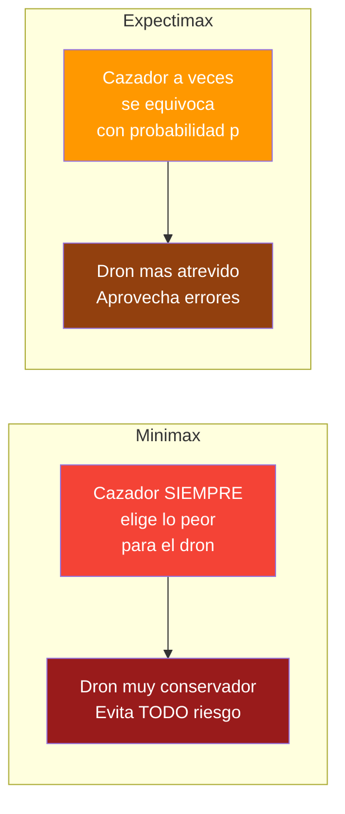
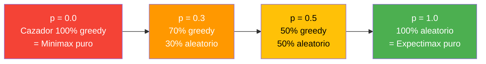
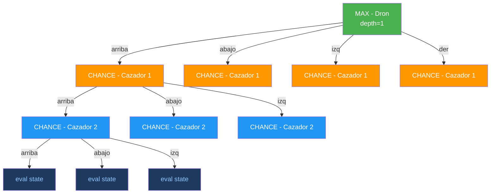
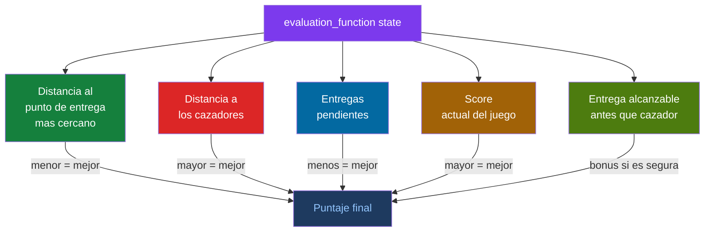
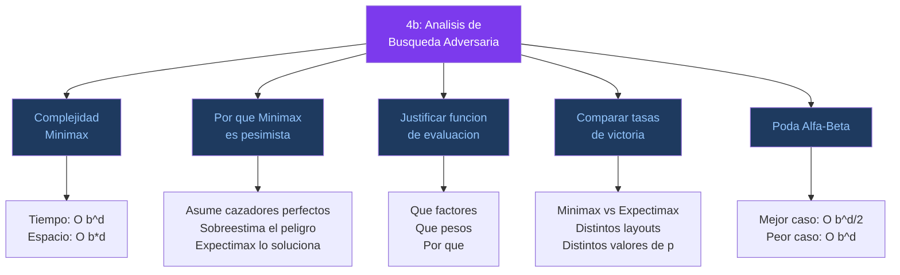
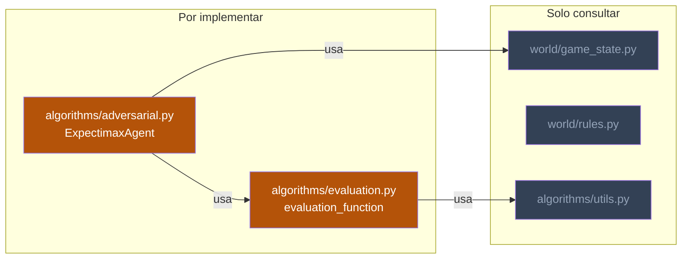

# Punto 3 y 4b — Explicacion Completa

## El Escenario



> El dron debe entregar suministros medicos en todos los puntos de entrega **sin ser atrapado** por los cazadores furtivos.

---

## El Juego por Turnos



**Estado terminal:**
- **Victoria (+1000):** El dron visito todos los puntos de entrega.
- **Derrota (-1000):** Un cazador comparte casilla con el dron.

---

## Minimax (Punto 2 — contexto)

En Minimax los cazadores son agentes **MIN** que **siempre** eligen la peor accion para el dron.



**Problema:** Minimax asume que el cazador **siempre** juega perfecto. Pero en la realidad a veces el cazador se mueve al azar, se equivoca o no ve al dron.

---

## Punto 3: Expectimax — lo que se debe implementar

En Expectimax los cazadores son nodos de **AZAR (CHANCE)** que combinan:
- Con probabilidad **(1-p):** actuan greedy (como MIN, peor caso)
- Con probabilidad **p:** actuan al azar (promedio uniforme)



### Formula del Nodo CHANCE

```
valor = (1 - p) * min(valores_hijos) + p * promedio(valores_hijos)
```

**Ejemplo con p = 0.3 y valores hijos [7, 8]:**

```
valor = (1 - 0.3) * min(7, 8) + 0.3 * mean(7, 8)
      = 0.7 * 7 + 0.3 * 7.5
      = 4.9 + 2.25
      = 7.15
```

| Algoritmo  | Resultado | Interpretacion                    |
|------------|-----------|-----------------------------------|
| Minimax    | 7.00      | Pesimista: asume peor caso        |
| Expectimax | 7.15      | Realista: pondera la aleatoriedad |

---

## Comparacion: Minimax vs Expectimax



### Valores de p y su significado



| Valor de p | Comportamiento del cazador | La formula se reduce a         |
|------------|----------------------------|--------------------------------|
| p = 0      | 100% greedy                | `min(hijos)` = Minimax         |
| 0 < p < 1  | Mixto (realista)           | Combinacion ponderada          |
| p = 1      | 100% aleatorio             | `mean(hijos)` = Expectimax puro|

---

## Estructura del Arbol de Juego (2 cazadores, depth=1)



> Despues de que **todos** los agentes se mueven (dron + todos los cazadores) se completa **1 nivel de profundidad**.

---

## Funcion de Evaluacion (evaluation.py)

Cuando el arbol llega a su profundidad maxima sin un estado terminal se llama `evaluation_function(state)` para estimar que tan bueno es ese estado. Se deben considerar factores como:



**Herramientas disponibles en `algorithms/utils.py`:**
- `bfs_distance(layout, start, goal, hunter_restricted)` — distancia BFS en pasos. Con `hunter_restricted=True` solo considera terreno libre (`.`), modelando el movimiento de cazadores.
- `dijkstra(layout, start, goal)` — costo de ruta ponderado por terreno (el dron paga 1 en libre, 2 en niebla, 3 en montana, 5 en tormenta).

**Datos del estado accesibles:**
- `state.get_drone_position()` — posicion (x, y) del dron
- `state.get_hunter_positions()` — lista de posiciones de cazadores
- `state.get_pending_deliveries()` — conjunto de entregas pendientes
- `state.get_score()` — score acumulado del juego
- `state.get_layout()` — layout del mapa
- `state.is_win()` / `state.is_lose()` — estados terminales

---

## Punto 4b: Analisis de Busqueda Adversaria

Preguntas que se deben responder en el documento PDF:



### 1. Complejidad de Minimax

| Metrica  | Complejidad | Descripcion                                      |
|----------|-------------|--------------------------------------------------|
| Tiempo   | O(b^d)      | b = factor de ramificacion, d = profundidad       |
| Espacio  | O(b * d)    | Solo almacena el camino actual (DFS)              |

Con **k cazadores**, cada turno completo tiene (1+k) capas de agentes, por lo que el arbol real es `O(b^(d*(1+k)))`.

### 2. Por que Minimax es pesimista con cazadores no optimos

Minimax asume que **cada cazador siempre elige la accion optima** (la peor para el dron). Si el cazador tiene 4 movimientos con valores `[-50, 30, 10, 20]`:

| Algoritmo         | Calculo                                     | Resultado |
|--------------------|---------------------------------------------|-----------|
| Minimax            | `min(-50, 30, 10, 20)`                      | -50       |
| Expectimax (p=0.5) | `0.5 * min(-50,30,10,20) + 0.5 * mean(...)` | -23.75    |

Minimax dice **-50** (catastrofe segura). Expectimax dice **-23.75** (riesgo moderado). Minimax sobreestima el peligro y hace que el dron tome decisiones demasiado conservadoras, perdiendo oportunidades de completar entregas.

### 3. Funcion de evaluacion

Describir y justificar la funcion disenada: que factores del estado se consideran, que pesos se asignan y por que. Debe balancear progreso en entregas con evasion de cazadores.

### 4. Poda Alfa-Beta

| Caso       | Nodos explorados | Descripcion                              |
|------------|------------------|------------------------------------------|
| Mejor caso | O(b^(d/2))       | Nodos ordenados perfectamente            |
| Peor caso  | O(b^d)           | Sin poda, igual que Minimax sin optimizar |

En el mejor caso Alfa-Beta explora la **raiz cuadrada** de los nodos que Minimax necesita.

---

## Archivos por modificar


