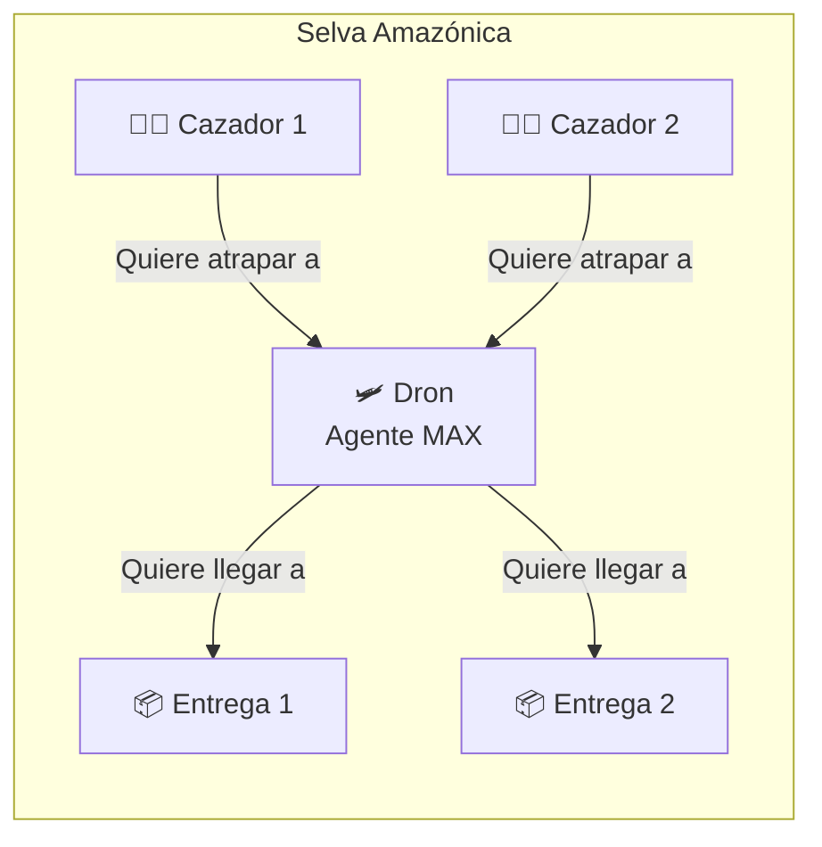
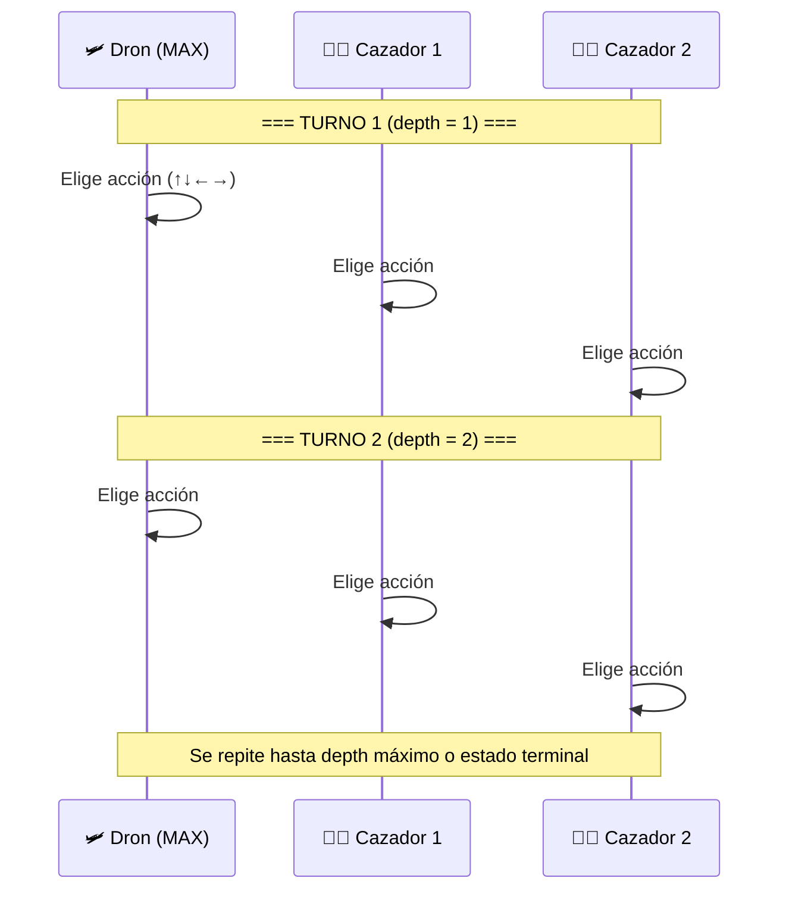
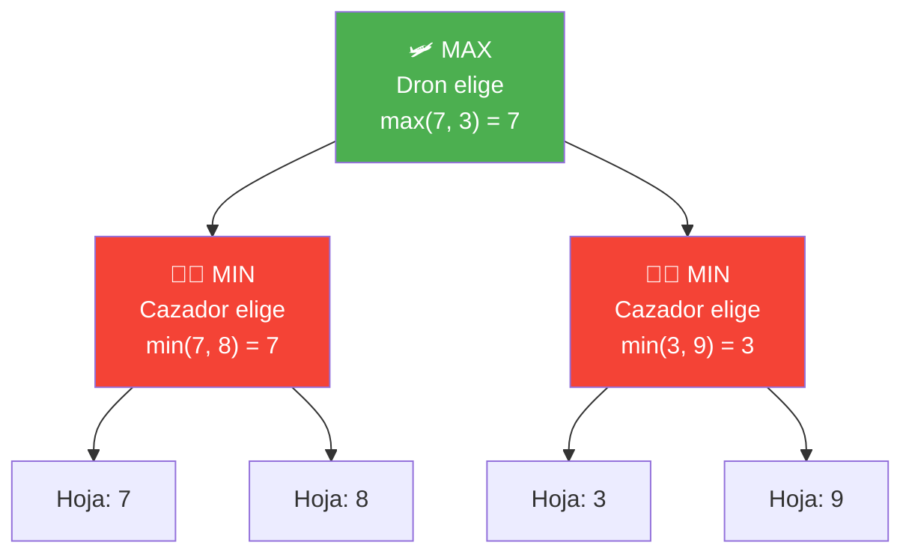
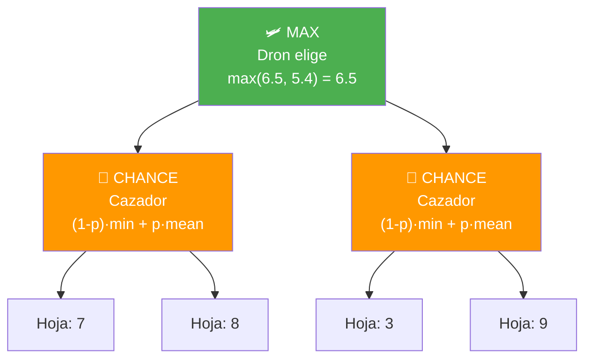
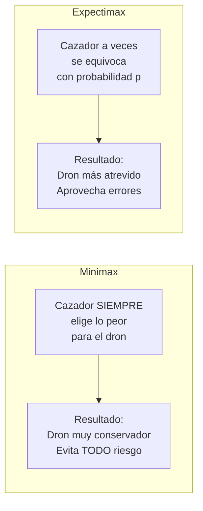
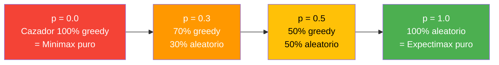
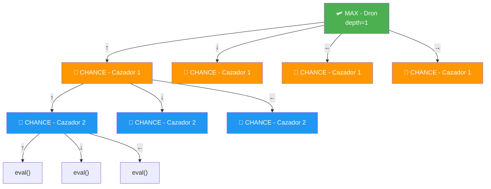
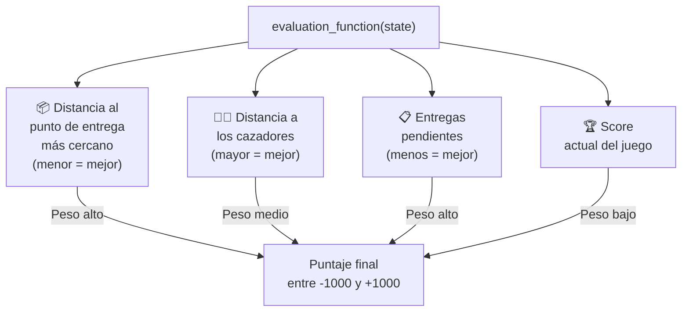
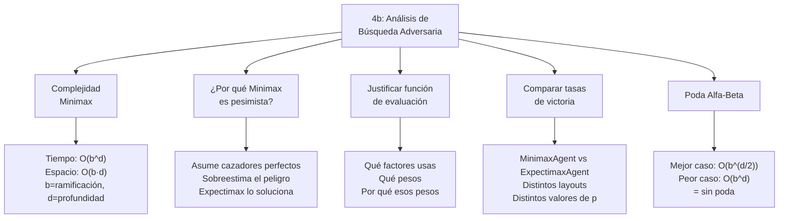
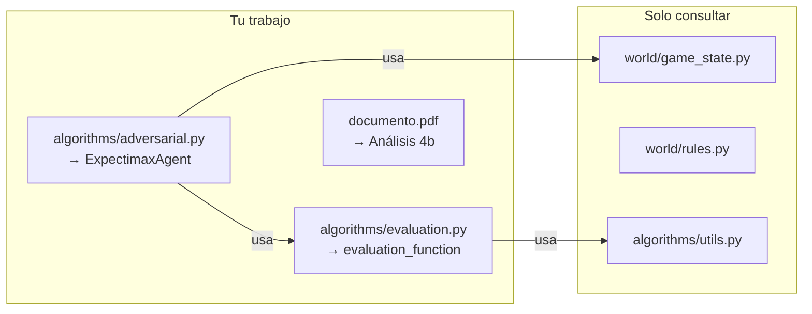

# Punto 3 y 4b — Explicación Completa

## El Escenario



> El dron debe entregar suministros médicos en todos los puntos de entrega **sin ser atrapado** por los cazadores furtivos.

---

## El Juego por Turnos



**Estado terminal:**
- **Victoria (+1000):** El dron visitó todos los puntos de entrega
- **Derrota (-1000):** Un cazador comparte casilla con el dron

---

## Punto 2: Minimax (lo que ya hicieron tus compañeros)

En Minimax, los cazadores son agentes **MIN** que **siempre** eligen la peor acción para el dron.



**Problema:** Minimax asume que el cazador **siempre** juega perfecto. Pero en la realidad, a veces el cazador se mueve al azar (es humano, se equivoca, no ve al dron).

---

## Punto 3: Expectimax (lo que TÚ implementas)

En Expectimax, los cazadores son nodos de **AZAR (CHANCE)** que combinan:
- Con probabilidad **(1-p):** actúan greedy (como MIN, peor caso)
- Con probabilidad **p:** actúan al azar (promedio uniforme)



### La Fórmula del Nodo CHANCE

```
valor = (1 - p) × min(valores_hijos) + p × promedio(valores_hijos)
```

**Ejemplo con p = 0.3 y valores hijos [7, 8]:**
```
valor = (1 - 0.3) × min(7, 8) + 0.3 × mean(7, 8)
       = 0.7 × 7 + 0.3 × 7.5
       = 4.9 + 2.25
       = 7.15
```

**Comparado con Minimax:**
- Minimax diría: `min(7, 8) = 7` (pesimista)
- Expectimax dice: `7.15` (más realista)

---

## Comparación Visual: Minimax vs Expectimax



### Valores de p y su significado



---

## Estructura del Árbol de Juego (con 2 cazadores, depth=1)



> Después de que **todos** los agentes se mueven (dron + todos los cazadores), se completa **1 nivel de profundidad**.

---

## La Función de Evaluación (evaluation.py)

Cuando el árbol llega a su profundidad máxima sin un estado terminal, se llama `evaluation_function(state)` para estimar qué tan bueno es ese estado.



---

## Punto 4b: Análisis que debes escribir



---

## Resumen: ¿Qué archivos tocas?


